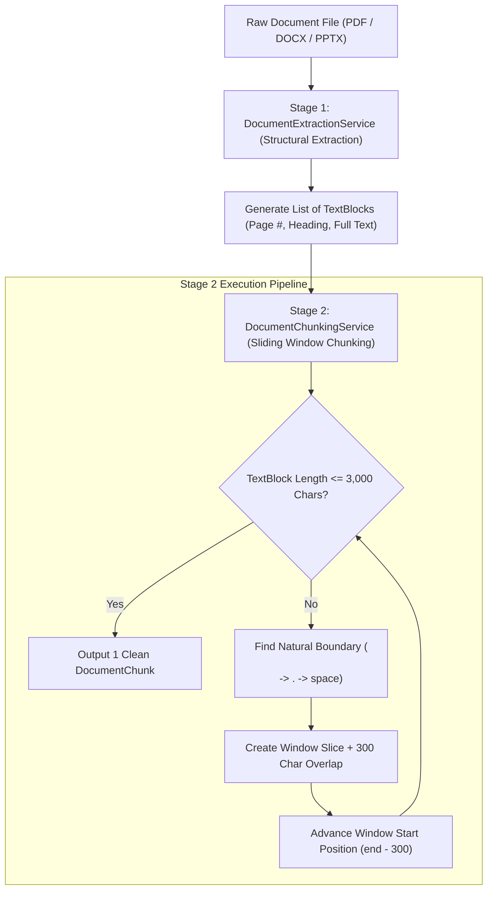

# 🧠 RAG Text Chunking Strategies & Architectural Justification

This document provides a comprehensive technical comparison of RAG (Retrieval-Augmented Generation) text chunking strategies, explaining alternative approaches, trade-offs, and why our **Hybrid Structural + Sliding Window with Natural Boundary Fallback** algorithm was selected for this project.

---

## 📊 1. Overview & Comparative Matrix

| Chunking Method | Algorithm Description | Primary Advantages | Drawbacks / Trade-offs | Selected for Project? |
| :--- | :--- | :--- | :--- | :---: |
| **1. Fixed-Size Chunking** | Splits text strictly every $N$ characters/tokens (e.g. 1000 chars) regardless of grammar. | • Simple implementation ($O(N)$ string slicing) • Extremely low CPU overhead | • **Destroys context** (cuts sentences & words in half) • Poor vector search quality | ❌ No |
| **2. Sliding Window + Boundary Fallback** | Fixed max window ($3,000$ chars) with overlap ($300$ chars). Searches backwards for `\n\n`, `. `, or `' '`. | • **Preserves complete sentences** • Maintains 10% overlap context • 100% C# native execution | • 10% storage overhead due to window overlap | **✅ YES (Core Engine)** |
| **3. Structural / Page-Aware Chunking** | Splits by HTML/Markdown headers (`# H1`), PPTX slides, or PDF page breaks. | • Respects human document layout • Preserves document hierarchy | • **Wildly uneven chunk sizes** (some pages have 5 words, others 15,000 words) | **✅ YES (Extraction Stage)** |
| **4. Semantic Distance Chunking** | Computes vector similarity between consecutive sentences; splits when vector distance spikes. | • Groups text by pure semantic topic shifts | • **100x higher latency** • Requires heavy Python ML SDKs (LangChain / LlamaIndex) | ❌ No |
| **5. Agentic / LLM-Based Chunking** | Sends document to LLM (GPT-4/Gemini) to generate structured sections. | • Highest possible chunk quality | • **Prohibitively expensive** (API costs per upload) • High network latency | ❌ No |

---

## 🏗️ 2. Our Implemented Hybrid Architecture

We implemented a **Two-Stage Hybrid Strategy** combining **Structural Extraction** and **Sliding Window Chunking**:

---

## 🧮 3. Technical Parameters & Mathematical Rationale

### 1️⃣ Window Size: `MaxChars = 3000` (~750 Tokens)
- **Token Formula**: $\text{Tokens} \approx \frac{\text{Characters}}{4} = \frac{3000}{4} = 750 \text{ tokens}$.
- **RAG Sweet Spot**: Vector embedding models (like OpenAI `text-embedding-3-small` or HuggingFace `all-MiniLM-L6-v2`) perform with highest retrieval precision on chunks between **500 and 1,000 tokens**.
- **Context Density**: 750 tokens is sufficient to hold 1–2 complete slide concepts or textbook paragraphs without diluting vector specificity.

### 2️⃣ Overlap Size: `OverlapChars = 300` (~75 Tokens / 10% Ratio)
- **Context Loss Prevention**: If a sentence spans across the boundary where Chunk 1 ends, splitting without overlap cuts the concept in half.
- **10% Overlap Ratio**: Repeating the trailing 300 characters of Chunk 1 at the start of Chunk 2 guarantees zero context loss across boundaries while adding only minimal (~10%) storage overhead.

### 3️⃣ Natural Boundary Fallback Priority
When a text block exceeds 3,000 characters, the window finder searches backward from index 3000 using the following priority:
1. `\n\n` (Paragraph Break) ➔ **Highest Priority**
2. `. ` (Sentence Boundary) ➔ **Second Priority**
3. `' '` (Word Boundary) ➔ **Fallback**

---

## 🎤 4. Presentation & Demo Defense Script

When asked during your demo why this chunking method was chosen:

> *"While naive systems use simple character slicing (which cuts words in half) and external frameworks rely on heavy Python AI packages, we engineered a native C# hybrid strategy:*
> 
> *First, `DocumentExtractionService` preserves document structure by extracting page numbers, section headers, and slide titles into `TextBlocks`.*
> 
> *Second, `DocumentChunkingService` applies a 3,000-character (~750 token) sliding window with 300-character (10%) overlap and natural boundary fallback (`\n\n` ➔ `. ` ➔ `' '`). This guarantees zero sentence fragmentation at chunk edges, optimal vector embedding quality, and fast C# execution with zero third-party AI framework dependencies."*
